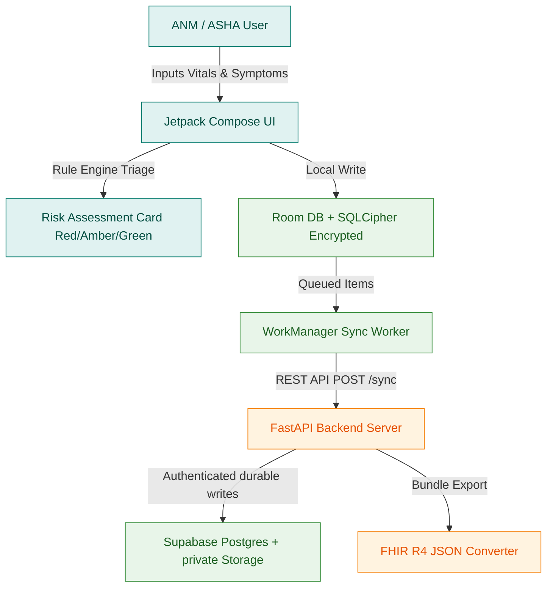

# SakhiCare

**An offline-first maternal healthcare assessment and triage platform for frontline health workers in rural settings.**

SakhiCare empowers Auxiliary Nurse Midwives (ANMs) and Accredited Social Health Activists (ASHAs) with instant clinical danger sign triage, offline case logging, and background server synchronization. It brings low-latency decision support to remote clinical encounters.

---

<div align="left">
  
  
  
  
  
  
  
  
  
</div>

---

## Table of Contents

- [Overview](#overview)
- [Features](#features)
- [Product Experience](#product-experience)
- [Architecture](#architecture)
- [Technology Stack](#technology-stack)
- [Design Philosophy](#design-philosophy)
- [Local Development](#local-development)
- [Future Roadmap](#future-roadmap)
- [Team](#team)
- [License](#license)

---

## Overview

SakhiCare is designed specifically for high-volume, low-connectivity healthcare environments. In rural clinical settings, frontline health workers often perform critical maternal screenings without reliable internet access. SakhiCare offers immediate rule-based danger sign calculation (Red / Amber / Green triage), local case persistence, and scheduled background sync when connectivity resumes.

---

## Features

- **Instant Clinical Danger Sign Triage** — Real-time assessment based on maternal vital signs (Blood Pressure, Haemoglobin) and qualitative danger symptoms (Bleeding, Fever, Severe Headache, Reduced Fetal Movement).
- **Clear Visual Risk Stratification**:
  - **RED**: Immediate emergency referral triggered by vaginal bleeding or high blood pressure ($\ge 140/90\text{ mmHg}$).
  - **AMBER**: High-priority observation triggered by fever or severe headache.
  - **GREEN**: Normal maternal checkup.
- **Offline-First Dashboard** — Displays connectivity status, pending sync count, quick assessment triggers, and recent case history.
- **FastAPI Sync Server** — Authenticated ingestion, durable Supabase persistence, FHIR export, notification audit, and deferred synchronization.
- **Care Desk Portal** — React + Vite portal for authenticated medical officers, supervisors, dispatchers, and administrators.
- **Secure location/audio handling** — Point-of-care coordinates are captured only with device permission; recordings are uploaded to private Supabase Storage only after authenticated sync.
- **Interoperability Ready** — Included FHIR R4 JSON bundle specs for seamless EHR integration.

---

## Product Experience

```
┌──────────────────┐      ┌──────────────────┐      ┌──────────────────┐
│ 1. Open Dashboard│ ───> │ 2. New Assessment│ ───> │ 3. Instant Triage│
└──────────────────┘      └──────────────────┘      └──────────────────┘
         ▲                                                   │
         │                                                   ▼
┌──────────────────┐                                ┌──────────────────┐
│ 5. Backend Sync  │ <───────────────────────────── │ 4. Review Cases  │
└──────────────────┘                                └──────────────────┘
```

1. **Dashboard** — Monitor network status badge ("Offline") and pending record count.
2. **New Assessment** — Input maternal vitals (BP, Hb) and select observed danger signs.
3. **Instant Triage** — Receive immediate Red/Amber/Green color-coded referral advisories.
4. **Review Cases** — Browse local case histories under "My Cases".
5. **Backend Sync** — Tap "Sync Now" to push pending records to the FastAPI server.

---

## Architecture



---

## Technology Stack

| Component | Technology | Version | Purpose |
|---|---|---|---|
| **Language** | Kotlin | 2.0.0 | Primary language for Android application |
| **UI Framework** | Jetpack Compose | 1.7.0 | Declarative UI framework for modern Android UI |
| **Local Database** | Room + SQLCipher | 2.6.1 | Local encrypted SQLite database layer |
| **Background Sync** | WorkManager | 2.9.0 | Deferred background synchronization manager |
| **Backend Framework**| FastAPI | 0.111.0 | High-performance Python REST API server |
| **Backend Runtime**  | Python | 3.11+ | Execution engine for backend services |
| **Database Engine**  | Supabase Postgres | managed | Production relational database engine |
| **Data Standard**   | FHIR R4 | 4.0.1 | Standardized healthcare data payload format |

---

## Design Philosophy

SakhiCare uses a clinical color system designed for high usability under sunlight and high-stress rural clinical workflows.

- **Teal Primary (`#00796B` / `#004D40`)** — Professional medical backdrop inspiring calm and confidence.
- **Red Emergency (`#D32F2F`)** — High urgency indicator for immediate maternal referral.
- **Amber Warning (`#F57C00`)** — Moderate risk indicator requiring secondary monitoring.
- **Green Normal (`#388E3C`)** — Clear confirmation of normal maternal parameters.

---

## Local Development

### Prerequisites

- **Android Studio** (Koala or newer) with JDK 17+
- **Python** 3.11+
- **pip** package installer

---

### 1. Running the FastAPI Backend

```bash
# Navigate to backend directory
cd backend

# Create virtual environment (optional)
python3 -m venv venv
source venv/bin/activate  # On Windows: venv\Scripts\activate

# Install requirements
pip install -r requirements.txt

# Start FastAPI dev server
uvicorn main:app --reload --port 8000
```

### Production configuration

Use `supabase/README.md` and `backend/.env.example` as the deployment contract. The backend receives the database URL, JWT secret, service-role key, SMS key, and OneSignal REST key only through its secret manager. The portal and APK receive only the Supabase URL and public publishable/anon key.

Build an APK with the deployed API and public Supabase values supplied as Gradle properties:

```bash
./gradlew assembleRelease \
  -PSAKHICARE_API_BASE_URL=https://api.example.org/ \
  -PSUPABASE_URL=https://your-project.supabase.co/ \
  -PSUPABASE_ANON_KEY=your-public-publishable-key
```

Release signing is intentionally not debug-signed. Supply `RELEASE_STORE_FILE`, `RELEASE_STORE_PASSWORD`, `RELEASE_KEY_ALIAS`, and `RELEASE_KEY_PASSWORD` from a protected CI secret store for a distributable APK/AAB.

Verify backend health at: [http://127.0.0.1:8000/health](http://127.0.0.1:8000/health)

---

### 2. Running the Android Application

1. Ensure JDK 17 is active (`export JAVA_HOME=/opt/homebrew/opt/openjdk@17`).
2. Run automated test suites:
   ```bash
   ./gradlew testDebugUnitTest
   ```
3. Assemble the debug APK:
   ```bash
   ./gradlew assembleDebug
   ```
4. Output APK location: `app/build/outputs/apk/debug/app-debug.apk`.

---

### 3. Running the Care Desk Portal (React + Vite)

```bash
# Navigate to portal directory
cd portal

# Install dependencies (if not already installed)
npm install

# Start development server
npm run dev

# Build production bundle
npm run build
```

---

## Implementation Status & Verification

All four phases of SakhiCare are fully implemented, hardened, and verified:

- [x] **Phase 1: Offline ASHA Foundation**
  - Room encrypted SQLite database with Keystore passphrase provider.
  - Deterministic clinical triage engine adhering to `mohfw-hrp-v1.0`.
  - Offline-first encounters, WorkManager sync queue, and conflict resolution.
- [x] **Phase 2: Voice Note to Form**
  - Vernacular voice-note recording with SHA-256 integrity verification.
  - AI extraction into structured fields with strict clinician confirmation before persistence.
  - Configurable audio retention policy purging audio once clinically validated.
- [x] **Phase 3: Durable Backend & Care Desk Portal**
  - FastAPI service with SQLAlchemy models and Alembic database migrations.
  - JWT Bearer authentication with server-enforced RBAC and facility scoping.
  - React + Vite Care Desk with SSE real-time updates and clinical case acknowledgement.
- [x] **Phase 4: Escalation, SMS, Transport, and Release Hardening**
  - 108 Emergency Transport coordination state machine with capability-based hospital routing.
  - Multi-channel escalation chain with Block Supervisor fallback (`SUPERVISOR_ANITA`).
  - Privacy-preserving minimal SMS contract (zero patient identity leakage).
  - Webhook callback for SMS delivery receipts decoupled from clinical state.
  - Deterministic demo data seeder and clean purge (`POST /api/v1/demo/seed`, `POST /api/v1/demo/purge`).
  - Zero fake network switches or canned fallbacks in production builds.

---

## Team

- **Arjun S**
- **Saurav G**

---

## License

This project is licensed under the MIT License - see the [LICENSE](LICENSE) file for details.

